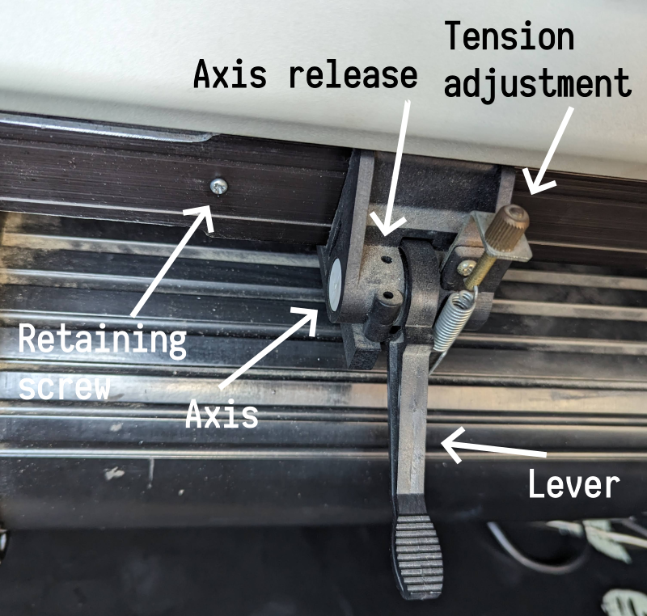

# Mechanical notes and fixes

## Hold-down lever repair

The long levers/cams that lift up the paper hold-down rollers stick
out and are liable to damage; two had already broken off by the time I
had started working on Gronk. Thanks to the magic of 3D printing,
these are easily replaced.

To replace a broken handle/cam:

* print out the `handle.stl` file in this directory
* unscrew the retaining screw
* for each hold-down that needs to be removed, raise the lever and
  slide the hold-down mechanism past the screw hole all the way to the
  end of the machine. They should come right off.
* use a small screwdriver or other implement to depress the axis
  release and push the plastic axis out.
* replace the broken lever with the printed replacement, replace the
  axis, and replace the mechanism. Be sure to put the retaining screw
  back in place when you're done.
  
